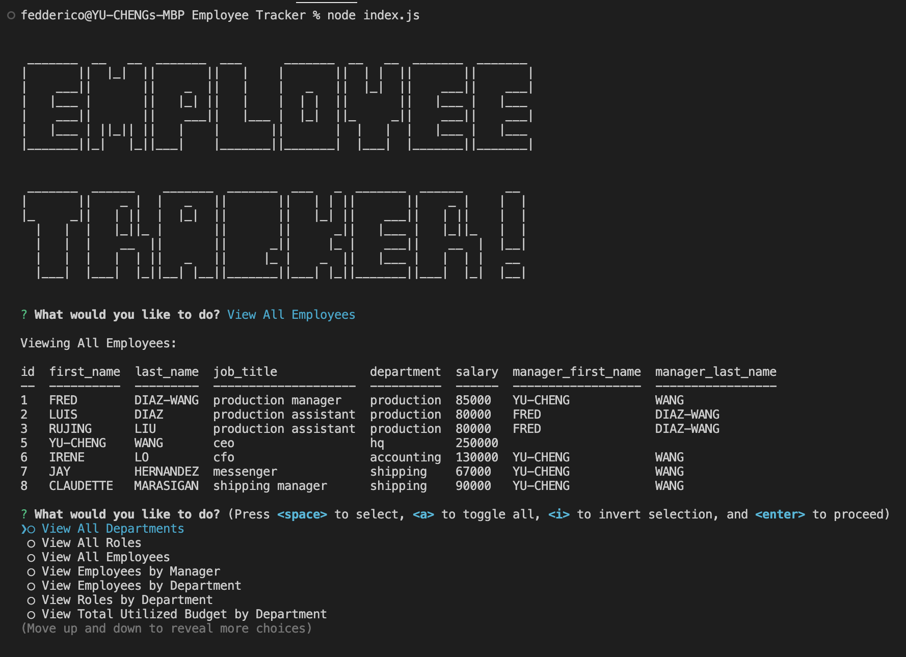
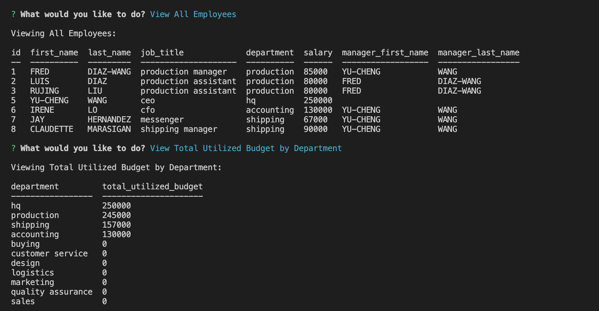

# NOTE TAKER 

  ## <a id="Description">Description</a> 

  This is a command line App that allows users to keep track of the employees of their company. It utilizes the inquirer package, dotenv package, and mysql2 package.

  Upon initiation of App, users will be prompted to select an option to proceed with from the main menu.

  The following are the 15 functions offered by this App:

  ```md
  1. View all the departments in the company
  2. View all the roles in the company
  3. View all the employees in the company
  4. View all the employees of a specified manager
  5. View all the roles in a department
  6. View all the employees within a department
  7. View the total utilized budget by department
  8. Add a new department
  9. Add a new role
  10. Add a new employee
  11. Delete a department
  12. Delete a role
  13. Delete an employee
  14. Update an employee's role
  15. Update an employee's manager 
  ```
  If at any point the user selects more than one option, skips entering necessary info (with the exception of updating an employee's manager to NULL), or enters a non-number for a new role's salary by mistake, they will be alerted accordingly and taken back to the main menu to start over. Upon success completion of a task, the App takes the users back to the main menu so they can select what they'd like to do next. Finally, there is an "Exit" option if they wish to quit the App.

  Click <a href="" target="_blank">HERE</a> for the video that demonstrates the functionality of this App. 
  (URL: )

  The URL of the Github repo is: https://github.com/FeddericoWayne/Employee-Tracker

  
  App screenshots:
  

  

***

  ## Table of Content

  ### [Description](#Description)
  ### [Installation](#Installation)
  ### [Usage](#Usage)
  ### [License](#License)
  ### [Contributing](#Contributing)
  ### [Tests](#Tests)
  ### [Questions](#Questions)

***

  ## <a id="Installation">Installation</a>

  No installation needed. Initiate this App in your command line with "node index.js"

***

  ## <a id="Usage">Usage</a>

  Use this app to record and track info on all the employees of your company, as well as inquiring the total utilized budget of each department.

***

  ## <a id="License">License</a>
  
  This App is covered under the MIT license.

  
***

  ## <a id="Contributing">Contributing</a>

  Please refer to the Question section of this README for my contact information if you'd like to contribute to this project!

***

  ## <a id="Tests">Tests</a>

  N/A
  

***

  ## <a id="Questions">Questions</a>

  For more info on my work, please check out my GitHub page at: https://github.com/feddericowayne
  
  Should you have any further questions regarding this App, please don't hesitate to reach out to me via email at: <a href="mailto:jackiew1120@hotmail.com">jackiew1120@hotmail.com</a>

  